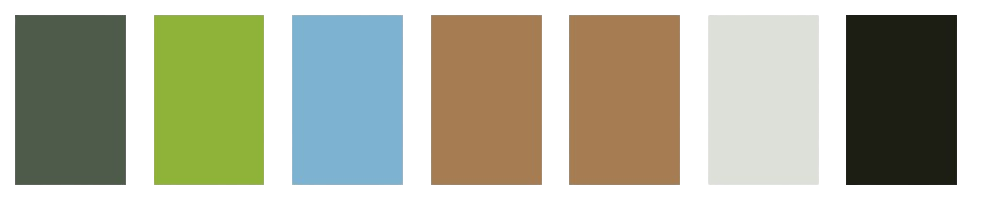
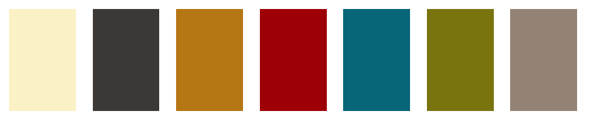

<h1 align="center">Mate Theme</h1>

  

The Mate theme for Visual Studio Code is a sleek, minimalistic, and highly readable color scheme designed to enhance the coding experience. With its balanced blend of vibrant yet soothing colors, Mate provides excellent contrast and differentiation between different elements in your code.

<h2 align="center">Palettes</h2>

<h3 align="center">Yerba Mate (dark)</h3>

  

<h3 align="center">Tererê (light)</h3>

  

<h2 align="center">Dark</h2>

  

<h2 align="center">Bright</h2>

  

